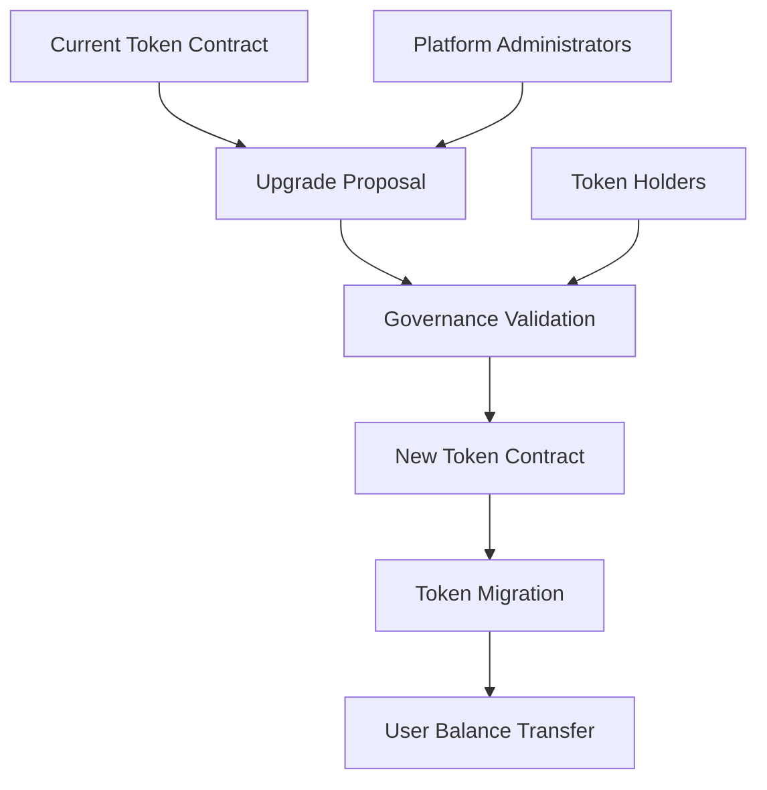

# BEP20 Token Upgrade Platform

A robust and flexible solution for secure BEP20 token contract upgrades and cross-network migrations.

## Overview

The BEP20 Upgrade Platform provides a comprehensive framework for managing token contract upgrades, enabling seamless transitions between different contract versions while maintaining token integrity, value, and user trust.

### Key Features
- Secure token contract upgrade mechanism
- Cross-network migration support
- Preserves token balances and ownership
- Flexible upgrade strategies
- Minimal transaction overhead

## Architecture



## Smart Contract: bep20-upgrade.clar

### Purpose
Manages the complex process of BEP20 token contract upgrades, ensuring a smooth and secure transition for token holders.

### Key Components
1. **Upgrade Proposals**: Define and validate contract upgrade parameters
2. **Migration Mechanisms**: Handle token balance transfer
3. **Governance Controls**: Manage upgrade authorization
4. **Fallback Protection**: Ensure user fund safety

## Getting Started

### Prerequisites
- Stacks wallet
- Basic understanding of BEP20 token standards

### Upgrade Example

```clarity
(contract-call? .bep20-upgrade propose-upgrade
    token-address
    new-contract-address
    migration-parameters
)
```

## Function Reference

### Upgrade Management
- `propose-upgrade`: Submit a new contract upgrade proposal
- `validate-upgrade`: Validate upgrade parameters
- `execute-migration`: Perform token migration

### Governance
- `set-upgrade-authority`: Define who can propose upgrades
- `set-migration-rules`: Configure migration parameters

## Development

### Testing
```bash
clarinet test
clarinet check
```

### Deployment
```bash
clarinet deploy --testnet
clarinet deploy --mainnet
```

## Security Considerations

### Upgrade Constraints
- Require multi-signature approval
- Implement time-lock mechanisms
- Validate new contract compatibility
- Limit migration window

### Best Practices
1. Comprehensive smart contract audits
2. Transparent upgrade process
3. Minimal downtime during migration
4. Provide clear user communication

## Disclaimer
Token upgrades involve financial risk. Always consult blockchain experts and conduct thorough testing.